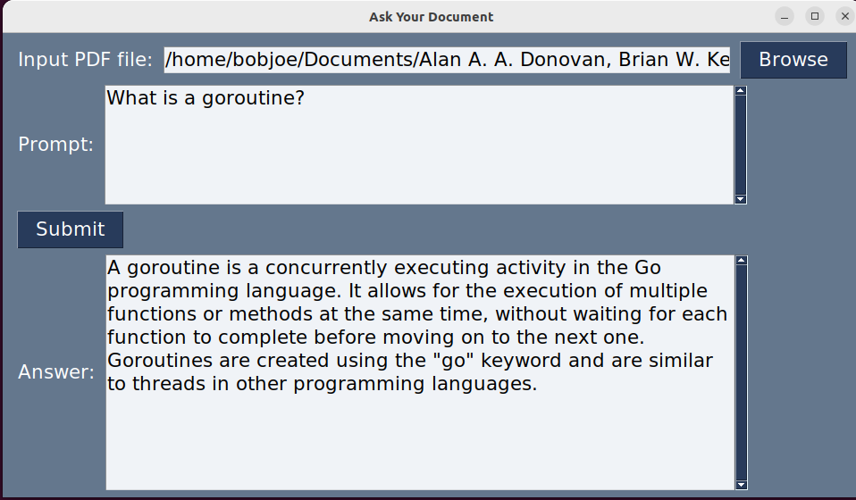

# Ask Your Document

Ask Your Document is a Python script that allows you to extract information from a PDF document using a query written in plain language. The script uses the OpenAI's `gpt-3.5-turbo-16k` model and [llama-index](https://github.com/awesome-openai/gpt_index) library to read and understand the document, and then provides answers to your queries based on the content of the document.

# GUI Version:

## Installation

### For Users

Please visit:

https://github.com/mkrupczak3/Ask-Your-Document/releases 

...to obtain an executable for your system

### For Developers


#### Prerequisites

- Python 3.11: If you don't already have Python 3.11 installed on your system, you can download it from the official Python [website](https://www.python.org/).
- OpenAI API Key: You will need to obtain an API key from OpenAI. You can get your API key from the OpenAI [website](https://platform.openai.com/account/api-keys).
- pip packages: various packages for python, installable with `pip` as described below

#### Installation

1. Install python3.11

2. Clone this project from GitHub (requires [git](https://github.com/git-guides/install-git)):
    ```bash
    git clone https://github.com/mkrupczak3/Ask-Your-Document
    ```

3. Go into the project directory:
    ```bash
    cd ask_your_document
    ```

4. Copy your OpenAI API key into the file `api.key` and save it

5. Install required pip packages
    ```bash
    python3.11 -m pip install -r requirements.txt
    ```
6. Run the script `download_loader_PyMuPDFReader.py`
   
   This script downloads a hidden dependency for llama_index called PyMuPDFReader. Without it, the program would be unable to parse PDF documents.

   ```bash
   python3.11 download_loader_PyMuPDFReader.py
   ```

6. Run the program
   ```bash
   python3.11 ask_your_document_GUI.py
   ```

## Screenshot(s):




## Notes:

If the program displays an authentication error saying it can't authenticate with the OpenAI API, please ensure you've provided a valid API key in the file `api.key`

# CLI Version:

## Installation

1. Install python3.11

2. Clone the project from GitHub (requires [git](https://github.com/git-guides/install-git)):
    ```bash
    git clone https://github.com/mkrupczak3/Ask-Your-Document
    ```

3. Go into the project directory:
    ```bash
    cd ask_your_document
    ```

4. Set up a Python virtual environment:
    ```bash
    python3.11 -m venv env
    ```

5. Activate the virtual environment:
    ```bash
    source env/bin/activate  # On Windows use `env\Scripts\activate`
    ```

6. Install the required packages:
    ```bash
    pip install -r requirements.txt
    ```

## Usage

Once you've set up your environment and installed the necessary packages, you can use the `ask_your_document.py` script to query your PDF document.

```bash
python3.11 ask_your_document.py --key 'YOUR_OPENAI_API_KEY' 'path_to_your_document.pdf' 'Your query here'
```

Replace `'YOUR_OPENAI_API_KEY'` with your actual OpenAI API key, `'path_to_your_document.pdf'` with the path to the PDF document you want to query, and `'Your query here'` with your actual query.

For example, if your OpenAI API key is `abcd1234`, the document you want to query is `document.pdf` located in the same directory, and your query is "What is the title of this document?", you would run:

```bash
python3.11 ask_your_document.py --key 'abcd1234' 'document.pdf' 'What is the title of this document?'
```

## Notes

If you encounter an error while trying to authenticate with the OpenAI API, please ensure you've provided a valid API key. You can either replace 'YOUR_OPENAI_API_KEY' with your actual OpenAI API key in the script, or provide it using the `--key` flag when you run the script.
